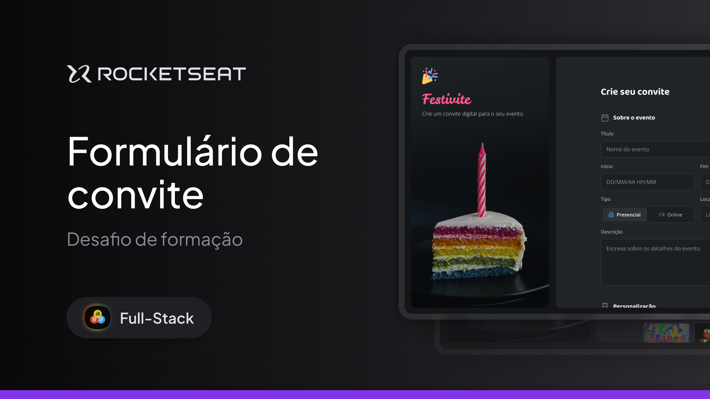

# Desafio prático - Formulário de convite

<picture>
  <source media="(prefers-color-scheme: dark)" srcset="assets/images/Thumbnail-md.png">
  <source media="(prefers-color-scheme: light)" srcset="assets/images/Thumbnail-md.png">
  
</picture>

### Conceitos trabalhados nessa aplicação:

|Conceitos                              |                   |
|---------------------------------------|-------------------|
|  ✔ Formulários HTML                   | ✔ Input de data               |
|  ✔ Input de texto                     | ✔ Radio               |
|  ✔ Estilização de inputs com CSS      | ✔ Estilização de formulários com CSS |
